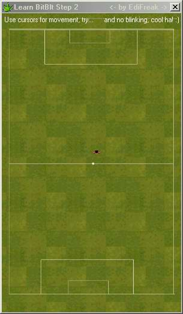



## Learn BitBlt \- Step 2

### Description

Part 2 of little tutorial that will learn you how to draw a picture from memory [RAM]. ||

-Put picture in memory ||

-Draw picture from memory ||

-Moving picture on the screen using KeyCode ||

-Draw text on the screen using API-TextOut |||||

Code well commented and easy to understand!
 
### More Info
 

             |
---                |---
**Submitted On**   |2003-04-20 03:24:26
**By**             |[Edi Budimilic](https://github.com/Planet-Source-Code/PSCIndex/blob/master/ByAuthor/edi-budimilic.md)
**Level**          |Beginner
**User Rating**    |4.5 (18 globes from 4 users)
**Compatibility**  |VB 5\.0, VB 6\.0
**Category**       |[Graphics](https://github.com/Planet-Source-Code/PSCIndex/blob/master/ByCategory/graphics__1-46.md)
**World**          |[Visual Basic](https://github.com/Planet-Source-Code/PSCIndex/blob/master/ByWorld/visual-basic.md)
**Archive File**   |[Learn\_BitB1586195102003\.zip](https://github.com/Planet-Source-Code/edi-budimilic-learn-bitblt-step-2__1-45403/archive/master.zip)

